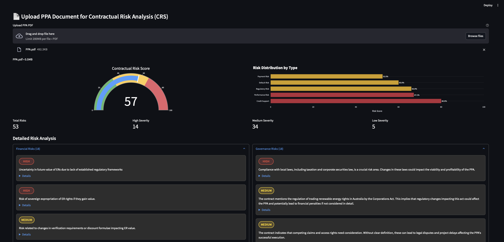

# AI Counterparty Risk Dashboard

This application was developed during a climate hackathon focused on leveraging AI agents to mitigate risks associated with energy projects. The AI Counterparty Risk Dashboard uses Gemini Flash 2.0 model to analyze risks associated with companies and their contracts.



## Features

- **Market-Based Financial Risk Analysis**: Analyzes the risk associated with a company based on news articles and financial data fetched from the News API and Yahoo Finance API.
- **Contractual Risk Analysis**: Specifically analyzes Power Purchase Agreements (PPAs) uploaded as PDFs and uses the Gemini API to identify potential risks within the contract.

## Technologies Used

- **Streamlit**: For building the interactive web application.
- **Google Gemini API**: For AI-based risk analysis.
- **News API**: For fetching news articles related to the company.
- **Yahoo Finance API**: For fetching financial data.
- **PyPDF**: For reading and processing PDF documents.
- **Sentence Transformers and FAISS**: For text embedding and similarity search.

## How It Works

### Market-Based Financial Risk Analysis

1. **Fetch Financial Data**: The application fetches financial data for a given company symbol using the Yahoo Finance API.
2. **Fetch News Articles**: News articles related to the company are fetched using the News API.
3. **Analyze Sentiment**: The sentiment of the news articles is analyzed using the Gemini API.
4. **Calculate Risk Scores**: Financial risk scores are calculated based on the fetched data and analyzed sentiment.
5. **Display Results**: The results are displayed in an interactive dashboard with charts and gauges.


### Contractual Risk Analysis

1. **Upload PPA Document**: Users can upload a PPA document in PDF format.
2. **Load and Process Document**: The document is processed and split into chunks for analysis.
3. **Analyze Risks**: The Gemini API is used to analyze the document for potential risks.
4. **Generate Risk Report**: A detailed risk report is generated and saved as a JSON file.
5. **Display Results**: The results are displayed in an interactive dashboard.

## Getting Started

### Prerequisites

- Python 3.9 or higher
- [Streamlit](https://streamlit.io/)
- [Google Gemini API Key](https://cloud.google.com/gemini)
- [News API Key](https://newsapi.org/)
- [Yahoo Finance API](https://www.yahoofinanceapi.com/)

### Installation

1. Clone the repository:
    ```sh
    git clone https://github.com/yourusername/climate-hackathon.git
    cd climate-hackathon
    ```

2. Install the required dependencies:
    ```sh
    pip install -r requirements.txt
    ```

3. Set up environment variables:
    ```sh
    cp .env.example .env
    # Update .env with your API keys
    ```

### Running the Application

1. Start the Streamlit application:
    ```sh
    streamlit run app.py
    ```

2. Open your web browser and navigate to `http://localhost:8501`.

## Usage

- **Market-Based Financial Risk Analysis**: Enter the company symbol and click "Fetch Data" to analyze the financial risk.
- **Contractual Risk Analysis**: Upload a PPA document in PDF format and click "Analyze Document" to generate a risk report.

